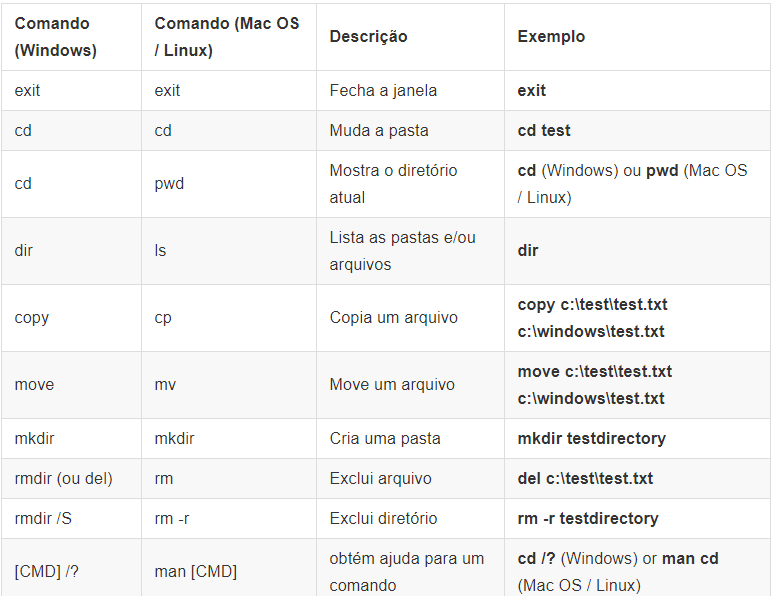

## Lista de comandos cmd


## Conceitos do python
### Variáveis:
    - Strings
    - Listas
    - Dicionários
    - Booleanos

### Estruturas:
    - Estruturas de condição
    - Estruturas de repetição
    - Funcões

## Sobre o django
### O que é o django?
### Por que você precisa de um framework?
### O que acontece quando alguém solicita um site do seu servidor?
    -urlresolve
    -view

## Instalando e criando um projeto com o django

    1. Instalando o virtual env
        $ pip -m venv nome_ambiente
        $ nome_ambiente/Scripts/activate
        $ pip install django

    2. Criando um projeto (com o django instalado)
        $ django-admin startproject nome_projeto
        $ cd nome_projeto
        $ python manage.py runserver

### Estrutura do projeto:
    nome_projeto
    ├───manage.py
    ├───mysite
    │        settings.py
    │        urls.py
    │        wsgi.py
    │        __init__.py
    └───requirements.txt

## Configurando o seu projeto

### O arquivo settings.py contem as configurações do seu projeto tais como:

```python
# Arquivo nome_projeto/settings.py

TIME_ZONE = 'America/Sao_Paulo'
LANGUAGE_CODE = 'pt-BR'

STATIC_URL = '/static/'
STATIC_ROOT = os.path.join(BASE_DIR, 'static')

ALLOWED_HOSTS = ['127.0.0.1', 'meusite.com']

DATABASES = {
'default': {
    'ENGINE': 'django.db.backends.sqlite3',
    'NAME': os.path.join(BASE_DIR, 'db.sqlite3'),
    }
}
```

### Criando uma aplicação 

    $ python manage.py startapp blog 

    nome_projeto
    ├── blog
    │   ├── __init__.py
    │   ├── admin.py
    │   ├── apps.py
    │   ├── migrations
    │   │   └── __init__.py
    │   ├── models.py
    │   ├── tests.py
    |   ├── urls.py
    │   └── views.py
    ├── db.sqlite3
    ├── manage.py
    ├── mysite
    │   ├── __init__.py
    │   ├── settings.py
    │   ├── urls.py
    │   └── wsgi.py
    └── requirements.txt

### Adicionando a aplicação ao projeto :

```python
# Arquivo nome_projeto/settings.py

INSTALLED_APPS = [
'django.contrib.admin',
'django.contrib.auth',
'django.contrib.contenttypes',
'django.contrib.sessions',
'django.contrib.messages',
'django.contrib.staticfiles',
'blog',
]
```

## Modelos e orientação a objetos

### Objetos possuem propriedades e ações :


|Post          |
|--------------|
|title         |
|text          |
|author        |
|created_date  |  
|published_date|
|publish()     |

### Modelos do django:
```python
# Arquivo blog/models.py

from django.conf import settings
from django.db import models
from django.utils import timezone


class Post(models.Model):
    author = models.ForeignKey(settings.AUTH_USER_MODEL, on_delete=models.CASCADE)
    title = models.CharField(max_length=200)
    text = models.TextField()
    created_date = models.DateTimeField(default=timezone.now)
    published_date = models.DateTimeField(blank=True, null=True)

    def publish(self):
        self.published_date = timezone.now()
        self.save()

    def __str__(self):
        return self.title
```

### Salvando o modelo e criando as tabelas no banco de dados :

    $ python manage.py makemigrations blog
    $ python manage.py migrate blog

## Django admin

```python
# Arquivo blog/admin.py

from django.contrib import admin
from .models import Post

admin.site.register(Post)
```

    $ python manage.py createsuperuser
    $ python manage.py runserver

## Deploy

### Github

    $ git init
    Initialized empty Git repository in ~/djangogirls/.git/
    $ git config --global user.name "Seu Nome"
    $ git config --global user.email voce@exemplo.com

### .gitignore

```.gitignore

*.pyc
*~
__pycache__
myvenv
db.sqlite3
/static
.DS_Store
```

### Enviando projeto para o github
1. Criar uma conta no github e um repositorio com o nome my-first-blog.
2. Rodar o seguinte comando :
    ```
    $ git remote add origin https://github.com/<seu-nome-de-usuário>/my-first-blog.git
    $ git push -u origin master


### Colocando o seu site na internet com o PythonAnywhere :

1. Criar uma conta no [PythonAnywhere](www.pythonanywhere.com)

2. Gerar um [token de API](https://www.pythonanywhere.com/user/jadsonlucio/account/#api_token) do PythonAnywhere

3. Configurar o seu site no PythonAnywhere:
    1. Navegue para a [Dashboard do PythonAnywhere](https://www.pythonanywhere.com/).

    2. Clicar na opção de iniciar um console "Bash".

    3. Rodar os seguintes comandos:
        ```
        $ pip3.6 install --user pythonanywhere
        
        $ pa_autoconfigure_django.py https://github.com/<your-github-username>/my-first-blog.git

    4. Clicar na aba web e acessar o link do seu site.

## URLs

```python
# Arquivo mysite/urls.py

"""mysite URL Configuration

[...]
"""
from django.contrib import admin
from django.urls import path, include

urlpatterns = [
    path('admin/', admin.site.urls),
    path('', include("blog.urls"))
]
```

```python
# Arquivo blog/urls.py

from django.urls import path
from . import views

urlpatterns = [
    path('', views.post_list, name='post_list'),
]
```

## Views 

```python
# Arquivo blog/views.py

from django.shortcuts import render
from django.http import HttpResponse

def post_list(request):
    return render(request, 'blog/post_list.html', {})

```

## Templates

### Templates são arquivos html que representam o formato (aparência) de uma determinada pagina que é carregada pelo Django. 

### Por convenção o django usa uma pasta chamada templates para buscar pelos templates do seu site

### Exemplo de template :
```html
<html>
    <head>
        <title>Blog Django Girls</title>
    </head>
    <body>
        <div>
            <h1><a href="/">Blog Django Girls</a></h1>
        </div>

        <div>
            <p>publicado: 14.06.2014, 12:14</p>
            <h2><a href="">Meu primeiro post</a></h2>
            <p>Aenean eu leo quam. Pellentesque ornare sem lacinia quam venenatis vestibulum. Donec id elit non mi porta gravida at eget metus. Fusce dapibus, tellus ac cursus commodo, tortor mauris condimentum nibh, ut fermentum massa justo sit amet risus.</p>
        </div>

        <div>
            <p>publicado: 14.06.2014, 12:14</p>
            <h2><a href="">Meu segundo post</a></h2>
            <p>Aenean eu leo quam. Pellentesque ornare sem lacinia quam venenatis vestibulum. Donec id elit non mi porta gravida at eget metus. Fusce dapibus, tellus ac cursus commodo, tortor mauris condimentum nibh, ut f.</p>
        </div>
    </body>
</html>
```

## QuerySets e ORM do Django

### Um QuerySet (conjunto de busca) é, em essência, uma lista de objetos de um dado modelo. QuerySet permite que você leia os dados a partir de uma base de dados, filtre e ordene.

### O Shell do Django
```
(myvenv) ~/djangogirls$ python manage.py shell
(InteractiveConsole)
>>>
```

### Todos os objetos de um model
```
>>> from blog.models import Post
>>> Post.objects.all()
```

### Criando e salvando um objeto
``` 
>>> me = User.objects.get(username='ola')
>>> Post.objects.create(author=me, title='Sample title', text='Test')
>>> Post.objects.all()
```

### Filtrando objetos
```
>>> Post.objects.filter(author=me)
>>> Post.objects.filter(title__contains='title')

>>> from django.utils import timezone
>>> Post.objects.filter(published_date__lte=timezone.now())
```

### Ordenando objetos 
```
>>> Post.objects.order_by('created_date')
```

## Dados dinâmicos em templates

```python
# Arquivo blog/views.py

from django.shortcuts import render
from django.utils import timezone
from .models import Post


def post_list(request):
    posts = Post.objects.filter(published_date__lte=timezone.now()).order_by('published_date') 
    return render(request, 'blog/post_list.html', {'posts': posts})
```

## Templates do Django
### Listas das principais funcionalidades dos templates do Django:
```
### Exibir conteúdo: 
{{ posts }}

### Iterar sobre uma lista:

    {{ post }}


### Carregar arquivos estáticos
 

### Carrega um template em um arquivo


### Referência uma parte do template para ser modificada



```

## CSS e Bootstrap

1. Adicionar as referências css do bootstrap

    ```html
    # Arquivo post_list.html

    <link rel="stylesheet" href="//maxcdn.bootstrapcdn.com/bootstrap/3.2.0/css/bootstrap.min.css">
    <link rel="stylesheet" href="//maxcdn.bootstrapcdn.com/bootstrap/3.2.0/css/bootstrap-theme.min.css">
    ```
2. Adicionar um arquivo css personalizado 
    ```
    djangogirls
    └─── blog
        └─── static
            └─── blog
                └─── css
                    └─── blog.css
    ```
3. Adiciona algum codigo a esse arquivo
    ```css
    # Arquivo blog.css

    .page-header {
        background-color: #C25100;
        margin-top: 0;
        padding: 20px 20px 20px 40px;
    }

    .page-header h1, .page-header h1 a, .page-header h1 a:visited, .page-header h1 a:active {
        color: #ffffff;
        font-size: 36pt;
        text-decoration: none;
    }

    .content {
        margin-left: 40px;
    }

    h1, h2, h3, h4 {
        font-family: 'Lobster', cursive;
    }

    .date {
        color: #828282;
    }

    .save {
        float: right;
    }

    .post-form textarea, .post-form input {
        width: 100%;
    }

    .top-menu, .top-menu:hover, .top-menu:visited {
        color: #ffffff;
        float: right;
        font-size: 26pt;
        margin-right: 20px;
    }

    .post {
        margin-bottom: 70px;
    }

    .post h2 a, .post h2 a:visited {
        color: #000000;
    }
    ```

4. Adicionar as seguintes linhas ao arquivo settings.py
    ```python
    # Arquivo settings.py

    STATIC_ROOT = os.path.join(BASE_DIR, 'static')
    STATIC_URL = '/static/'
    ```

5. Carregar os arquivos estaticos (css) no template html
    ```html
    
    <link rel="stylesheet" href="">
    ```

6. Substituir a lista de postagens no arquivo post_list.html

    ```html
    # Arquivo post_list.html
    <div class="page-header">
        <h1><a href="/">Django Girls Blog</a></h1>
    </div>

    <div class="content container">
    <div class="row">
    <div class="col-md-8">
        
            <div class="post">
                <div class="date">
                    <p>published: {{ post.published_date }}</p>
                </div>
                <h2><a href="">{{ post.title }}</a></h2>
                <p>{{ post.text|linebreaksbr }}</p>
            </div>
        
    </div>
    </div>
    </div>
    ```

## Criando um template base

```html
# Arquivo base.html

<div class="page-header">
    <h1><a href="/">Django Girls Blog</a></h1>
</div>

<div class="content container">
<div class="row">
<div class="col-md-8">
    
        <div class="post">
            <div class="date">
                <p>published: {{ post.published_date }}</p>
            </div>
            <h2><a href="">{{ post.title }}</a></h2>
            <p>{{ post.text|linebreaksbr }}</p>
        </div>
    
</div>
</div>
</div>
```

```html
# Arquivo post_list.html




    
        <div class="post">
            <div class="date">
                {{ post.published_date }}
            </div>
            <h2><a href="">{{ post.title }}</a></h2>
            <p>{{ post.text|linebreaksbr }}</p>
        </div>
    


```

## Ampliar a aplicação 

1. Criando um link para os detalhes de um post
    ```html
    # Arquivo post_list.html

    <h2><a href="">{{ post.title }}</a></h2>
    ```
2. Adicionando uma url para esse link
    ```python
    # Arquivo blog/urls.py

    from django.urls import path
    from . import views

    urlpatterns = [
        path('', views.post_list, name='post_list'),
        path('post/<int:pk>/', views.post_detail, name='post_detail'),
    ]
    ```

3. Criando uma view para essa url
    ```python
    # Arquivo blog/views.py

    def post_detail(request, pk):
        post = get_object_or_404(Post, pk=pk)
        return render(request, 'blog/post_detail.html', {'post': post})

4. Criando o template para essa view
    ```html
    

    
        <div class="post">
            
                <div class="date">
                    {{ post.published_date }}
                </div>
            
            <h2>{{ post.title }}</h2>
            <p>{{ post.text|linebreaksbr }}</p>
        </div>
    ]
    ```

## Formulários do Django
1. Criando um arquivo de formulário
    ```
    blog
    └── forms.py

2. Criando um formulário
    ```python
    # Arquivo blog/forms.py

    from django import forms
    from .models import Post

    class PostForm(forms.ModelForm):

        class Meta:
            model = Post
            fields = ('title', 'text',)

3. Adicionando um link de criação de formulário à pagina inicial 
    ```html
    # Arquivo base.html

    <a href="  class="top-menu"><span class="glyphicon glyphicon-plus"></span></a>
    ```

4. Adicionar a url de criação de post
    ```python
    # Arquivo blog/urls.py

    from django.urls import path 
    from . import views

    urlpatterns = [
        path('', views.post_list, name='post_list'),
        path('post/<int:pk>/', views.post_detail, name='post_detail'),
        path('post/new/', views.post_new, name='post_new'),
    ]
    ```

5. Criar a view 
    ```python
    # Arquivo blog/views.py

    from .forms import PostForm

    def post_new(request):
        if request.method == "POST":
            form = PostForm(request.POST)
            if form.is_valid():
                post = form.save(commit=False)
                post.author = request.user
                post.published_date = timezone.now()
                post.save()
                return redirect('post_detail', pk=post.pk)
        else:
            form = PostForm()
        return render(request, 'blog/post_edit.html', {'form': form})
    ```

6. Criando o template
    ```html
    # Arquivo blog/templates/blog/post_edit.html

    

    
        <h2>New post</h2>
        <form method="POST" class="post-form">
            {{ form.as_p }}
            <button type="submit" class="save btn btn-default">Save</button>
        </form>
    
    ```

7. Validação de formulários


## Outros links 

### Django
Nosso outro livro: [Django Girls Tutorial:         Extensions](https://tutorial-extensions.djangogirls.org/)

[Tutorial oficial do Django](https://docs.djangoproject.com/en/2.0/intro/tutorial01/)

[Começando com as aulas de vídeo do Django](http://www.gettingstartedwithdjango.com/)

### HTML, CSS and JavaScript
[Curso de desenvolvimento web do Codecademy](https://www.codecademy.com/learn/learn-python)

[freeCodeCamp](https://www.freecodecamp.org/)

### Python
[Curso de Python do Code Academy](https://www.codecademy.com/learn/learn-python)

[Curso Python do Google](https://developers.google.com/edu/python/)

Livro [Learn Python The Hard Way](http://learnpythonthehardway.org/book/) - os exercícios iniciais são grátis

[Tutoriais New Coder](http://newcoder.io/tutorials/) - uma variedade de exemplos práticos que você pode usar Python

[edX](https://www.edx.org/course?search_query=python) – você pode assistir a maior parte dos cursos de graça, porem se você quiser um certificado ou créditos para validação em curso superior, então haverá um custo

[Especialização em Python do Coursera](https://www.coursera.org/specializations/python) - alguns videos podem ser assistidos de graça e você pode ganhar um certificado por atender aos cursos

[Python para todos](https://www.py4e.com/) - uma versão gratuita e aberta do Coursera Python para especialização de todo mundo

Trabalhando com dados
[Codecademy curso de data science](https://www.codecademy.com/learn/paths/data-science)

[edX](https://www.edx.org/course/?search_query=python&subject=Data%20Analysis%20%26%20Statistics) – você pode assistir a maior parte dos cursos de graça, porem se você quiser um certificado ou créditos para validação em curso superior, então haverá um custo

[Dataquest](https://www.dataquest.io/) – as primeiras 30 "missões" são gratuitas